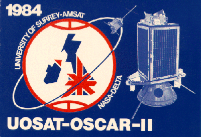
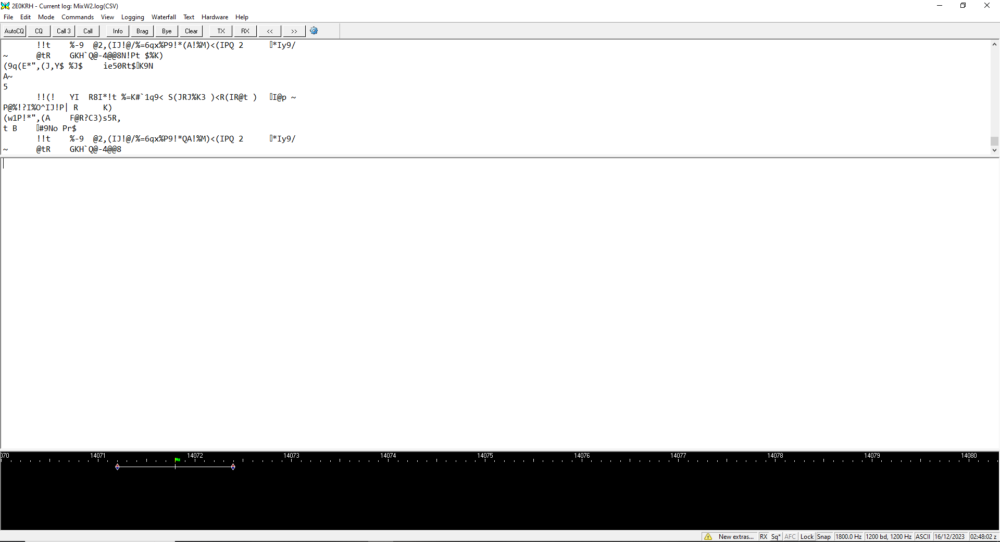
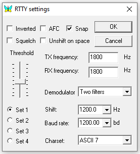
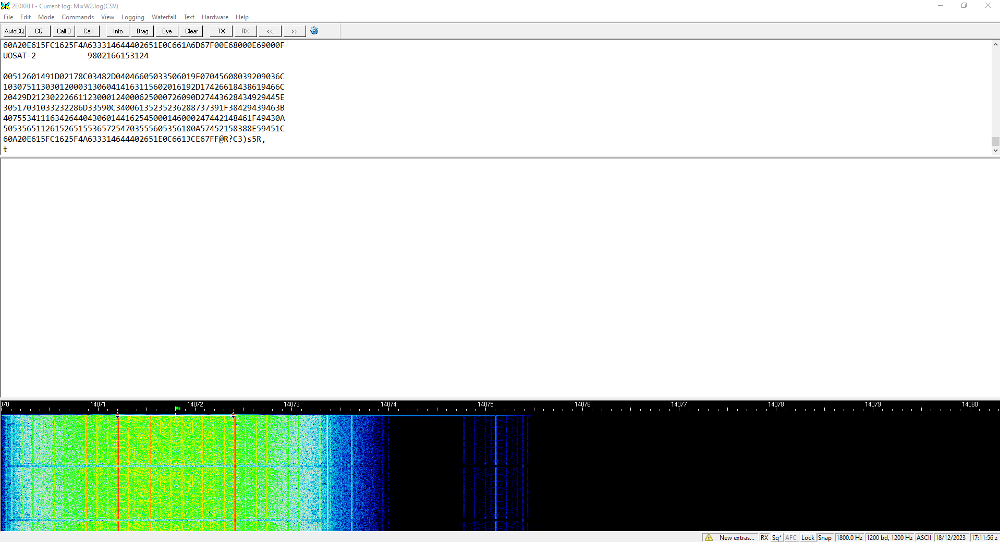
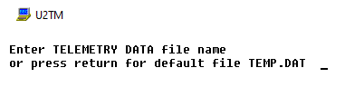
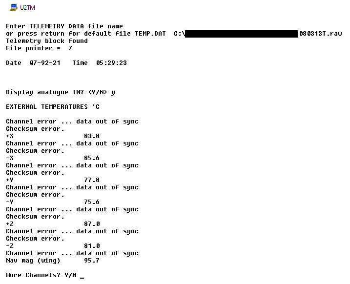



<h1><b>UoSat-2</b> (UO-11)</h1>

**UoSAT-2** or **U**niversity of **S**urrey s**AT**ellite is a British spacecraft in a Low Earth Sun-synchronous Orbit

It was developed and built by a team of enthusiastic radio amateurs and engineers in the 1980s at the *University of Surrey* and later the spacecraft was operated by *Surrey Satellite Technology Ltd*

Also refered to as 'UO-11' or OSCAR-11 the satellite also functions as a amateur radio transmitter which can still be recieved today on the 2m ham band

I feel it is very fitting for me to write up about this satellite, at the time of writing this I am a student at the University of Surrey and run the Radio Club on campus, where many spaces I look after have history in being involved with satellite activities 

Please enjoy my collected information about this very special satellite!

  

    Table of contents
  

  {: .text-delta }
1. TOC
{:toc}

# History

On March 1st, 1984... UoSAT-2 was launched from Vandenberg SLC-2W on a Delta 3920 Rocket, hitching a ride from the LANDSAT-5 mission

I was able to find this video deeply hidden on the University of Surrey servers - sit back and enjoy this lovely clip of the satellite created by **Harold Price, NK6K**!

<video controls>
    <source src="{{ site.my-media-path }}files/uosat-2-coming-home.mp4" type="video/mp4">
</video>

 
 
UOSAT-OSCAR-II Mission Card
{: .lh-tight .fs-2 }

# Recieving

UoSAT-2 can still be recieved to this day, supprisingly after 40 years of operation!

**Mode B Beacon:**

The spacecraft operates a VHF beacon which transmits AFSK modulation every 30 seconds

{: .info }
> Be aware that the satellite operates in a 10.3 day ON, 10.4 day OFF cycle

## Beacon Information
- **Frequency:** 145.825 MHz
- **Power:** 450mW
- **Mode:** RTTY
- **Baud:** 1200 bps
- **Char:** ASCII-7

The signal can be recieved in any way you would like - however, it is suggested to use a SDR of some kind and a designated satellite antenna

## Software

### MIXW

Having scoured the internet, the only good piece of software I can find to decode a signal at a Baud of 1200 bps is [MIXW](https://mixw.net/) which seems to be very popular for this purpose

 

You will need to set the following settings below to recieve the raw data:

The two main settings are to set the *Baud Rate to 1200 bps* and the *Charset to ASCII-7* otherwise your recieved data will be incorrect

These settings can be changed by right clicking the `Baud/Shift` box on the far bottom right

Here is an example of a decode of the UoSAT-2 satellite showing its raw telemety data

You should end up with something like this, where you will have the text `UOSAT-2` followed by a string of numbers and letters

| UOSAT-2 &emsp;&emsp;&emsp;&emsp; 0792214052923  00000001000102000203000304000405000506006070007080008090009 1000011100001200031300d!4 00515005160071700061800091;0008 20000221000322000023000!20010625000726000407000528000A29000B ?a30000331000232000133000034000735000636000537 00438000B29000A 40000041000542000643000744000045800146000247000fm\000B49000D 50000551000452000n5300865400015000056000357000258000D59000C 60800E615FC162010563320564442651E0C6627E@67000168000E69000F |

{: .note }
> This data is could be the same repeated by the satellite 16 times in succession

There is usually a few frames of data dropped due to the signal being less than optimal so do not be disheartened - it should still be able to be converted to telemetry data fine

Make sure you save this data from MIXW as a `.RAW` file with the text data starting with UOSAT-2

### U2TM

Even though this is such a old satellite, there are some bits of amazing software - originally written for the BBC Micro 

The best I have been able to get going is **U2TM** which I have archived and can download, full credit to the creator and for making it possible to run in a Windows environment

[Download U2TM here][1]

When running U2TM you will be greeted with this window

Enter the **EXACT** location of the `.RAW` file previously created with MIXW and then press return

If successful and a telemetry block has been found, you will be greeted with this

By following the instructions you can cycle and read the telemetry data you have recieved!

# References

<https://amsat-uk.org/satellites/tlm/uosat-2-oscar-11/> 
<https://web.archive.org/web/20150413193503/http://g3cwv.co.uk/oscar11.htm> 
<https://www.g0kla.com/amsat50/uo-11.php> 
<https://www.satblog.info/> 
<https://www.dk3wn.info/wp/satelliten/uosat-oscar-uo-11/> 

[1]:{{ site.url }}/satellites/files/u2tm.zip